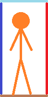

# KFGZ Platformer game

### Menu
* start button
* shop
* settings
* exit
### Game
* Scene

   Character  
   movement (jump, slide, attack, use item)   
   the character is made up of four **QGraphicsLineItem**s   
      
   if any of these collide with the environment the characters movement changes accordingly, for example if the bottom one makes contact the character stops falling, since it touched the ground.
   
   Opponents  
   different types
   
   Map  
   pre-made blocks (buildings, enemies, textures)  
   blocks coming after eachother randomly
* Count score, money
### Shop
   